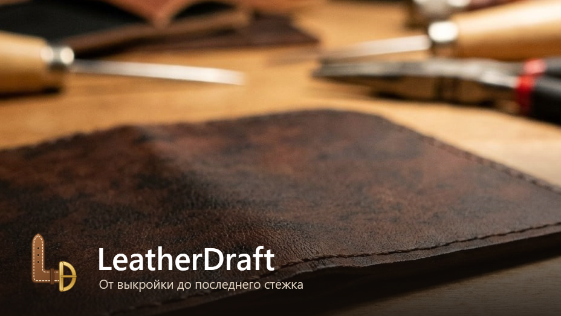
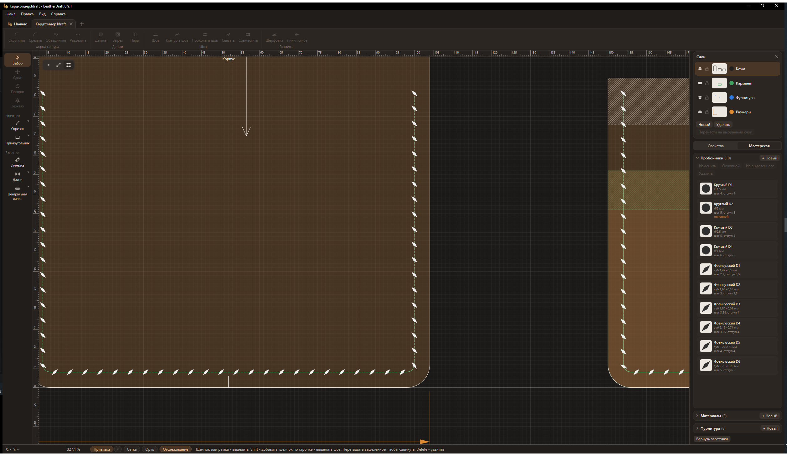
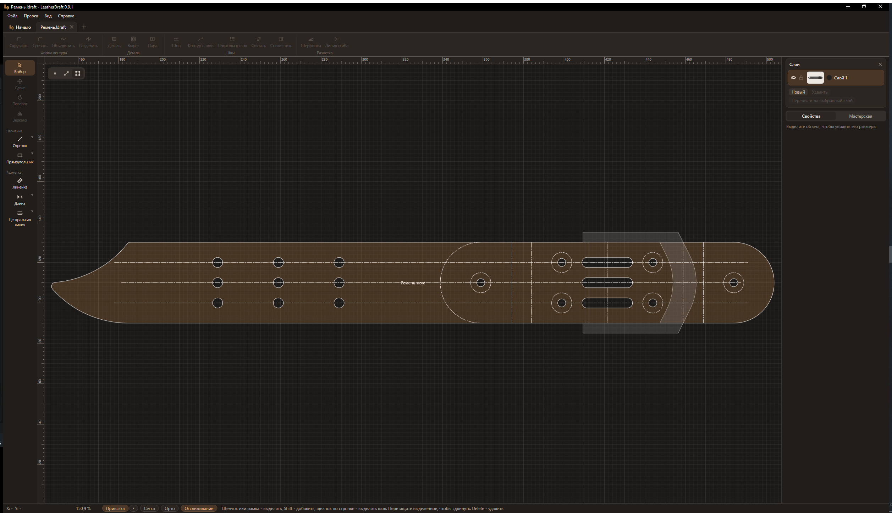
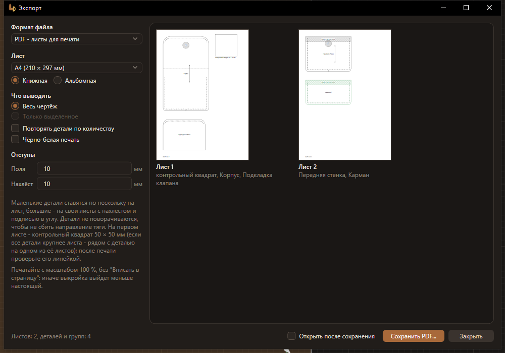
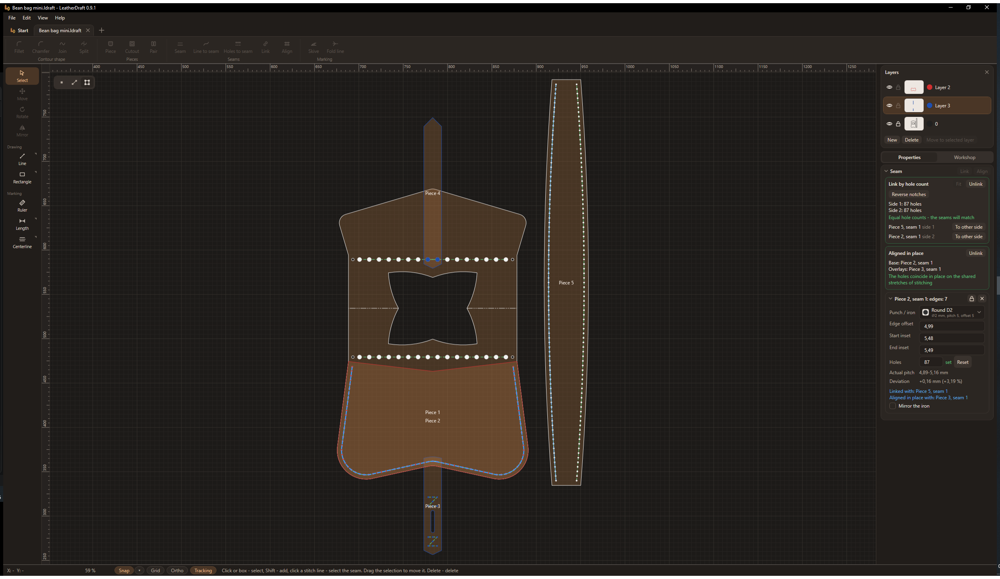
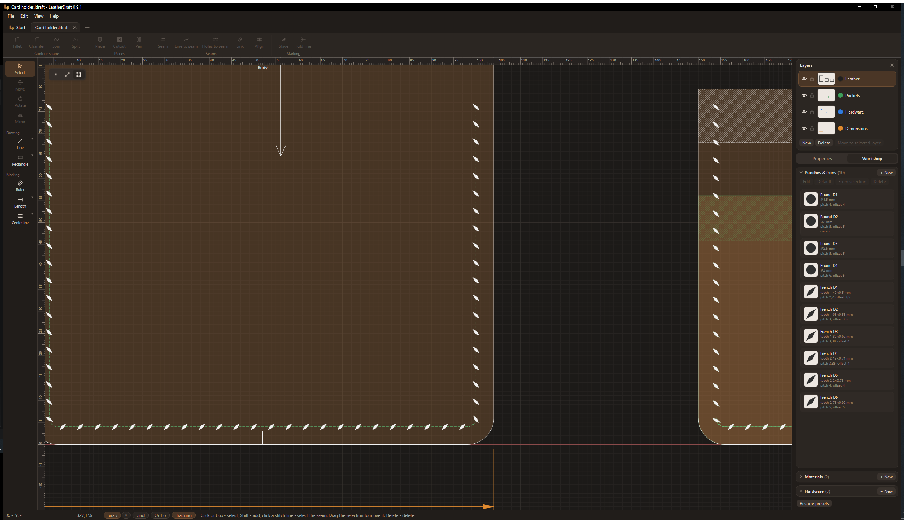
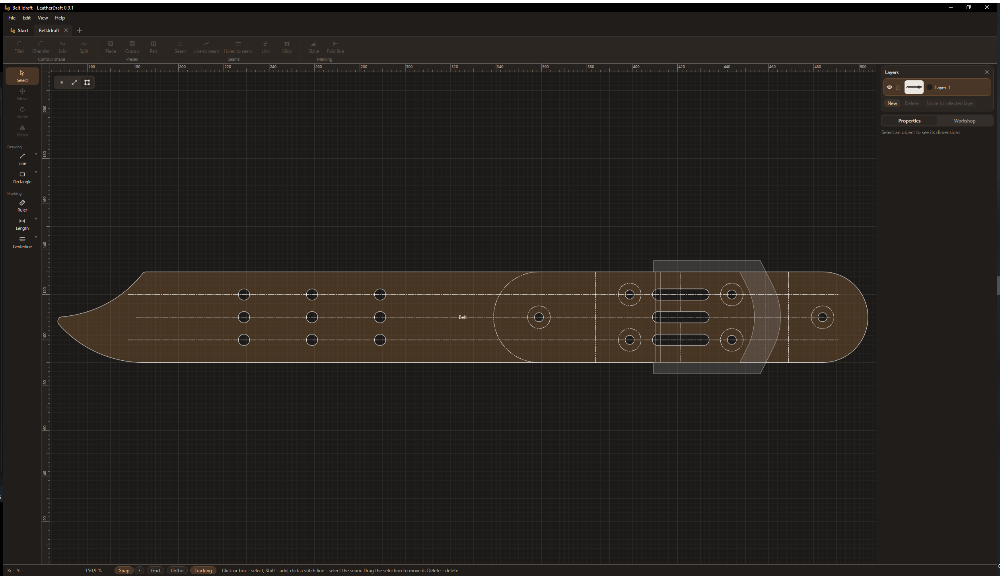
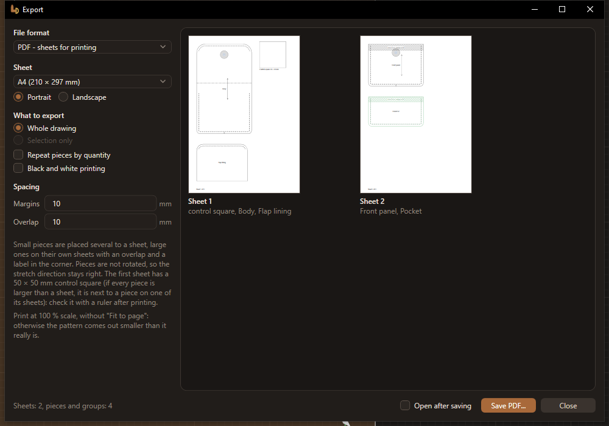

# LeatherDraft

**Программа для выкроек изделий из кожи.** Чертите детали, ставьте швы с проколами под свой пробойник, печатайте выкройку
в натуральную величину или отдавайте на лазер и режущий плоттер.

[English below](#english)

## Скачать

**[Скачать установщик для Windows](https://github.com/DoctorAranea/LeatherDraft-Releases/releases/latest/download/LeatherDraft-win-Setup.exe)**

Все версии и что в них нового - на странице [выпусков](https://github.com/DoctorAranea/LeatherDraft-Releases/releases).

Программа бесплатная, в том числе для работы на продажу. Выкройки, сделанные в ней, принадлежат вам. Условия - в файле
[LICENSE.txt](LICENSE.txt).

## Что умеет

- Детали и вырезы, швы с проколами под ваш пробойник и шаг
- Связанные швы: на сшиваемых сторонах выходит одинаковое число проколов
- Совмещение строчек по месту: карман на стенке, ремешок на корпусе - проколы совпадают
- Метки совмещения, линии сгиба, шерфовка, стрелка направления тяги, размеры и осевые линии
- Фурнитура: кнопки, хольнитены, люверсы, прорези; половинки кнопки связываются в пару
- Зеркальные пары деталей: правка одной повторяется на другой
- Печать в натуральную величину на листах A4 и других, с нахлёстом и контрольным квадратом
- Экспорт в PDF, SVG и DXF для лазера и плоттера, открытие чертежей DXF, DWG и SVG
- Интерфейс на русском и английском

## Как это выглядит

Шов сумки связан с боковиной по числу проколов и совмещён по месту с накладной деталью:

Строчка под французский пробойник крупным планом и пробойники мастерской:

Ремень с отверстиями под фурнитуру:

Печать выкройки на листах A4 с контрольным квадратом:

## Требования

- Windows 10 или 11, 64-разрядная.
- Около 20 МБ на диске C. Если на компьютере нет среды .NET 8, установщик поставит её сам - это ещё около 160 МБ.
- Права администратора не нужны.
- Интернет нужен только для установки .NET 8 и для обновлений, работать можно без сети.
- Для печати выкроек - любой принтер.

## Установка

1. Скачайте установщик и запустите его. Прав администратора не нужно: программа ставится для вашей учётной записи.
2. Windows может показать окно "Windows защитила ваш компьютер": у программы пока нет платной цифровой подписи. Нажмите
   "Подробнее", затем "Выполнить в любом случае".
3. Если на компьютере нет среды .NET 8, установщик скачает и поставит её сам.

**Обновления** приходят сами: раз в день программа проверяет, не вышла ли новая версия, скачивает её и ставит, когда вы
закроете программу. Отключить это можно в настройках, раздел "Обновления".

**Удалить** программу можно как любую другую: "Параметры Windows" - "Приложения" - LeatherDraft. Ваши чертежи при этом
остаются на месте.

## Нашли ошибку или есть идея

Напишите в раздел [Issues](https://github.com/DoctorAranea/LeatherDraft-Releases/issues). Чтобы ошибку было проще найти,
укажите:

- версию программы - она в заголовке окна, например "LeatherDraft 0.9.1";
- что вы делали и что пошло не так;
- если программа сообщила об ошибке - приложите журнал `%LocalAppData%\LeatherDraft\logs\errors.log`;
- если ошибка связана с чертежом - приложите файл .ldraft.

---

# LeatherDraft

**A pattern maker for leather goods.** Draw pieces, add seams with holes for your pricking iron, print the pattern at
full size or send it to a laser cutter or a cutting plotter.

[На русском - выше](#leatherdraft)

## Download

**[Download the installer for Windows](https://github.com/DoctorAranea/LeatherDraft-Releases/releases/latest/download/LeatherDraft-win-Setup.exe)**

All versions and what is new in them are on the [releases](https://github.com/DoctorAranea/LeatherDraft-Releases/releases)
page.

The program is free, including for work you sell. The patterns you make with it belong to you. The terms are in
[LICENSE.txt](LICENSE.txt).

## Features

- Pieces and cutouts, seams with holes for your pricking iron and pitch
- Linked seams: both sides that are sewn together get the same number of holes
- Aligning stitch lines in place: a pocket on a wall, a strap on a body - the holes match
- Alignment notches, fold lines, skiving, grain direction arrow, dimensions and center lines
- Hardware: snaps, rivets, eyelets, slots; the two halves of a snap are linked into a pair
- Mirror pairs of pieces: an edit to one is repeated on the other
- Full-size printing on A4 and other sheets, with overlap and a control square
- Export to PDF, SVG and DXF for lasers and plotters, opening DXF, DWG and SVG drawings
- Interface in Russian and English

## What it looks like

A bag seam linked to the gusset by hole count and aligned in place with an overlay piece:

A stitch line for a French pricking iron up close, and the punches and irons in the workshop:

A belt with holes for hardware:

Printing the pattern on A4 sheets with a control square:

## Requirements

- Windows 10 or 11, 64-bit.
- About 20 MB on drive C. If .NET 8 is not installed on the computer, the installer adds it - about 160 MB more.
- No administrator rights are needed.
- The internet is needed only to install .NET 8 and for updates; you can work offline.
- Any printer for printing patterns.

## Installation

1. Download the installer and run it. No administrator rights are needed: the program is installed for your user account.
2. Windows may show a "Windows protected your PC" window: the program does not have a paid digital signature yet. Click
   "More info", then "Run anyway".
3. If .NET 8 is not installed on the computer, the installer downloads and installs it.

**Updates** arrive on their own: once a day the program checks for a new version, downloads it and installs it when you
close the program. You can turn this off in the settings, in the "Updates" section.

**Uninstall** the program like any other: Windows "Settings" - "Apps" - LeatherDraft. Your drawings stay where they are.

## Found a bug or have an idea

Write in [Issues](https://github.com/DoctorAranea/LeatherDraft-Releases/issues). To make the bug easier to find,
include:

- the program version - it is in the window title, for example "LeatherDraft 0.9.1";
- what you were doing and what went wrong;
- if the program reported an error - attach the log `%LocalAppData%\LeatherDraft\logs\errors.log`;
- if the bug is related to a drawing - attach the .ldraft file.
